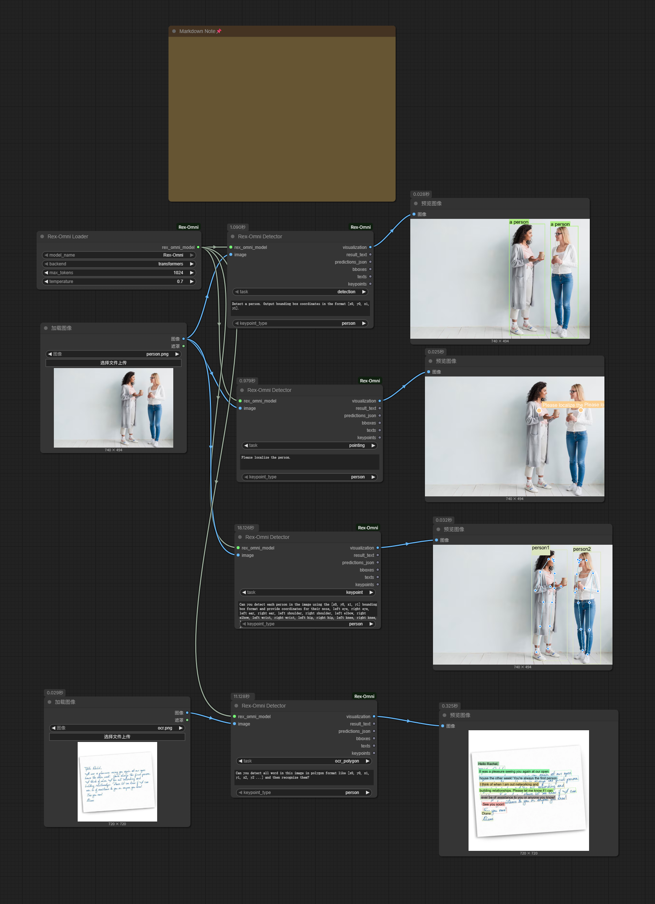

# ComfyUI-Rex-Omni

[](https://www.python.org/downloads/)
[](https://github.com/comfyanonymous/ComfyUI)
[](LICENSE)

> **⚠️ Important Notice**: Since I'm not very familiar with coding, this plugin was written by Claude. Some features are working, but there are still other issues that need to be fixed. If you encounter any problems, please submit an issue.

A powerful ComfyUI custom node for integrating Rex-Omni multimodal AI models. This node provides seamless integration of Rex-Omni's advanced computer vision and natural language processing capabilities into your ComfyUI workflows.

## 🌟 Features

- **Multimodal AI Integration**: Seamlessly integrate Rex-Omni models into ComfyUI workflows
- **Multiple Task Support**: Object detection, text recognition, keypoint detection, and more
- **Flexible Backend Options**: Support for both Transformers and vLLM backends
- **Real-time Visualization**: Built-in visualization capabilities for detection results
- **JSON Output**: Structured JSON output for easy integration with other nodes
- **Batch Processing**: Efficient batch processing of multiple images
- **Customizable Parameters**: Fine-tune model behavior with temperature, max tokens, and more

## 📋 Requirements

- Python 3.8+
- ComfyUI
- PyTorch
- PIL (Pillow)
- NumPy
- Rex-Omni models

## 🚀 Installation

### Method 1: Git Clone (Recommended)

```bash
cd ComfyUI/custom_nodes/
git clone https://github.com/flybirdxx/ComfyUI-RexOmni.git
```

### Method 2: Manual Installation

1. Download the repository as a ZIP file
2. Extract it to `ComfyUI/custom_nodes/ComfyUI-Rex-Omni/`
3. Ensure all dependencies are installed

### Model Download

Before using this plugin, you need to download the Rex-Omni model:

**Model URL**: [https://huggingface.co/IDEA-Research/Rex-Omni](https://huggingface.co/IDEA-Research/Rex-Omni)

**Download Path**: `models/Rex-Omni/`

#### Download Methods:

1. **Using Hugging Face CLI** (Recommended):
```bash
# Install huggingface_hub
pip install huggingface_hub

# Download model to specified path
huggingface-cli download IDEA-Research/Rex-Omni --local-dir models/Rex-Omni
```

2. **Using Git LFS**:
```bash
git lfs install
git clone https://huggingface.co/IDEA-Research/Rex-Omni models/Rex-Omni
```

3. **Manual Download**:
   - Visit the [Hugging Face model page](https://huggingface.co/IDEA-Research/Rex-Omni)
   - Download all files to the `models/Rex-Omni/` directory

### Dependencies Installation

```bash
pip install torch torchvision pillow numpy huggingface_hub
```

## 📖 Usage

### Node Overview

This custom node provides two main components:

1. **Rex-Omni Loader**: Loads and configures Rex-Omni models
2. **Rex-Omni Detector**: Performs inference and returns results

### Basic Workflow

1. **Load Model**: Use the `Rex-Omni Loader` node to load your desired Rex-Omni model
2. **Process Image**: Connect your image to the `Rex-Omni Detector` node
3. **Configure Parameters**: Set task type, confidence threshold, and other parameters
4. **Get Results**: Receive detection results, visualizations, and JSON data

### Node Parameters

#### Rex-Omni Loader
- **Model Name**: Select from available Rex-Omni models
- **Backend**: Choose between "transformers" or "vllm"
- **Max Tokens**: Maximum number of tokens for text generation (1-4096)
- **Temperature**: Sampling temperature for text generation (0.0-2.0)

#### Rex-Omni Detector
- **Model**: Connect the loaded model from Rex-Omni Loader
- **Image**: Input image for processing
- **Task Type**: Type of task to perform (detection, recognition, etc.)
- **Confidence Threshold**: Minimum confidence for detections (0.0-1.0)
- **Max Results**: Maximum number of results to return
- **Show Labels**: Whether to show labels in visualization
- **Show Confidence**: Whether to show confidence scores in visualization

### Output Types

The detector node provides multiple output types:

1. **Detection Results**: Structured detection data
2. **Visualization Image**: Annotated image with detections
3. **JSON Data**: Formatted JSON output for further processing
4. **Bounding Boxes**: Extracted bounding box coordinates
5. **Text Results**: Extracted text content
6. **Keypoints**: Detected keypoint coordinates

## 🎯 Supported Tasks

- **Object Detection**: Detect and localize objects in images
- **Text Recognition**: Extract and recognize text from images
- **Keypoint Detection**: Detect human pose keypoints
- **Image Classification**: Classify images into categories
- **Visual Question Answering**: Answer questions about images
- **Image Captioning**: Generate descriptive captions for images

## 📊 Example Workflow

The following workflow demonstrates the Rex-Omni nodes in action, showcasing multiple computer vision tasks:



This example workflow shows:
- **Object Detection**: Detecting people in images with bounding boxes
- **Localization**: Precise pointing and localization tasks
- **Keypoint Detection**: Detailed human pose keypoint extraction
- **OCR**: Text recognition with polygon-based word detection

### Example Workflow Files

You can find the following files in the `example_workflow/` directory:
- `example_workflow.json` - Complete workflow configuration file
- `workflow.png` - Workflow visualization image
- Various test image files

## 🐛 Troubleshooting

### Common Issues

1. **Model Not Found**: Ensure models are placed in the correct directory
2. **CUDA Out of Memory**: Reduce batch size or use CPU backend
3. **Import Errors**: Check that all dependencies are installed correctly

## 🤝 Contributing

We welcome contributions! Please feel free to submit a Pull Request. For major changes, please open an issue first to discuss what you would like to change.

## 📄 License

This project is licensed under the MIT License - see the [LICENSE](LICENSE) file for details.

## 🙏 Acknowledgments

- [ComfyUI](https://github.com/comfyanonymous/ComfyUI) for the amazing framework
- [Rex-Omni](https://huggingface.co/IDEA-Research/Rex-Omni) for the multimodal AI models
- [IDEA-Research](https://huggingface.co/IDEA-Research) team for developing the Rex-Omni model
- The open-source community for inspiration and support

## 📞 Support

If you encounter any issues or have questions:

1. Check the [Issues](https://github.com/flybirdxx/ComfyUI-RexOmni/issues) page
2. Create a new issue with detailed information
3. Join our community discussions

---

**Note**: This is a custom node for ComfyUI. Make sure you have ComfyUI properly installed and configured before using this node.

[中文文档](README_CN.md) | [English Documentation](README.md)
