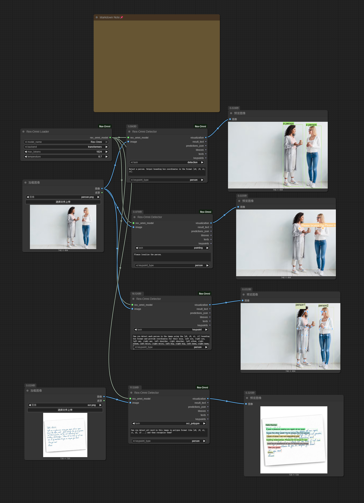

# ComfyUI-Rex-Omni

[](https://www.python.org/downloads/)
[](https://github.com/comfyanonymous/ComfyUI)
[](LICENSE)

> **⚠️ 重要提示**：由于我不懂代码，本插件由Claude编写，部分功能已经跑通，但是还有一些其他问题需要等待修复，如果遇到问题请提issue。

一个强大的ComfyUI自定义节点，用于集成Rex-Omni多模态AI模型。该节点将Rex-Omni先进的计算机视觉和自然语言处理能力无缝集成到您的ComfyUI工作流中。

## 🌟 功能特性

- **多模态AI集成**：将Rex-Omni模型无缝集成到ComfyUI工作流中
- **多任务支持**：目标检测、文本识别、关键点检测等多种任务
- **灵活的后端选项**：支持Transformers和vLLM两种后端
- **实时可视化**：内置检测结果可视化功能
- **JSON输出**：结构化JSON输出，便于与其他节点集成
- **批量处理**：高效的多图像批量处理
- **可定制参数**：通过温度、最大令牌数等参数微调模型行为

## 📋 系统要求

- Python 3.8+
- ComfyUI
- PyTorch
- PIL (Pillow)
- NumPy
- Rex-Omni模型

## 🚀 安装方法

### 方法一：Git克隆（推荐）

```bash
cd ComfyUI/custom_nodes/
git clone https://github.com/flybirdxx/ComfyUI-RexOmni.git
```

### 方法二：手动安装

1. 下载仓库ZIP文件
2. 解压到 `ComfyUI/custom_nodes/ComfyUI-Rex-Omni/` 目录
3. 确保所有依赖项已安装

### 模型下载

在使用此插件之前，您需要下载Rex-Omni模型：

**模型地址**: [https://huggingface.co/IDEA-Research/Rex-Omni](https://huggingface.co/IDEA-Research/Rex-Omni)

**下载路径**: `models/Rex-Omni/`

#### 下载方法：

1. **使用Hugging Face CLI**（推荐）：
```bash
# 安装huggingface_hub
pip install huggingface_hub

# 下载模型到指定路径
huggingface-cli download IDEA-Research/Rex-Omni --local-dir models/Rex-Omni
```

2. **使用Git LFS**：
```bash
git lfs install
git clone https://huggingface.co/IDEA-Research/Rex-Omni models/Rex-Omni
```

3. **手动下载**：
   - 访问 [Hugging Face模型页面](https://huggingface.co/IDEA-Research/Rex-Omni)
   - 下载所有文件到 `models/Rex-Omni/` 目录

### 依赖项安装

```bash
pip install torch torchvision pillow numpy huggingface_hub
```

## 📖 使用说明

### 节点概览

此自定义节点提供两个主要组件：

1. **Rex-Omni加载器**：加载和配置Rex-Omni模型
2. **Rex-Omni检测器**：执行推理并返回结果

### 基本工作流

1. **加载模型**：使用 `Rex-Omni Loader` 节点加载所需的Rex-Omni模型
2. **处理图像**：将图像连接到 `Rex-Omni Detector` 节点
3. **配置参数**：设置任务类型、置信度阈值等参数
4. **获取结果**：接收检测结果、可视化和JSON数据

### 节点参数

#### Rex-Omni加载器
- **模型名称**：从可用的Rex-Omni模型中选择
- **后端**：选择"transformers"或"vllm"
- **最大令牌数**：文本生成的最大令牌数（1-4096）
- **温度**：文本生成的采样温度（0.0-2.0）

#### Rex-Omni检测器
- **模型**：连接从Rex-Omni加载器加载的模型
- **图像**：用于处理的输入图像
- **任务类型**：要执行的任务类型（检测、识别等）
- **置信度阈值**：检测的最小置信度（0.0-1.0）
- **最大结果数**：返回的最大结果数量
- **显示标签**：是否在可视化中显示标签
- **显示置信度**：是否在可视化中显示置信度分数

### 输出类型

检测器节点提供多种输出类型：

1. **检测结果**：结构化的检测数据
2. **可视化图像**：带有检测标注的图像
3. **JSON数据**：格式化的JSON输出，便于进一步处理
4. **边界框**：提取的边界框坐标
5. **文本结果**：提取的文本内容
6. **关键点**：检测到的关键点坐标

## 🎯 支持的任务

- **目标检测**：检测和定位图像中的对象
- **文本识别**：从图像中提取和识别文本
- **关键点检测**：检测人体姿态关键点
- **图像分类**：将图像分类到不同类别
- **视觉问答**：回答关于图像的问题
- **图像描述**：为图像生成描述性标题

## 📊 示例工作流

以下工作流展示了Rex-Omni节点的实际应用，演示了多种计算机视觉任务：



此示例工作流展示了：
- **目标检测**：在图像中检测人员并绘制边界框
- **定位**：精确的指向和定位任务
- **关键点检测**：详细的人体姿态关键点提取
- **OCR**：基于多边形格式的文本识别

## 🐛 故障排除

### 常见问题

1. **找不到模型**：确保模型放置在正确的目录中
2. **CUDA内存不足**：减少批次大小或使用CPU后端
3. **导入错误**：检查所有依赖项是否正确安装

## 🤝 贡献

我们欢迎贡献！请随时提交Pull Request。对于重大更改，请先打开一个问题来讨论您想要更改的内容。

## 📄 许可证

本项目采用MIT许可证 - 查看[LICENSE](LICENSE)文件了解详情。

## 🙏 致谢

- [ComfyUI](https://github.com/comfyanonymous/ComfyUI) 提供出色的框架
- [Rex-Omni](https://huggingface.co/IDEA-Research/Rex-Omni) 提供多模态AI模型
- [IDEA-Research](https://huggingface.co/IDEA-Research) 团队开发了Rex-Omni模型
- 开源社区提供灵感和支持

## 📞 支持

如果您遇到任何问题或有疑问：

1. 查看[问题](https://github.com/flybirdxx/ComfyUI-RexOmni/issues)页面
2. 创建包含详细信息的新问题
3. 加入我们的社区讨论

---

**注意**：这是ComfyUI的自定义节点。使用此节点之前，请确保已正确安装和配置ComfyUI。

[English Documentation](README.md) | [中文文档](README_CN.md)
